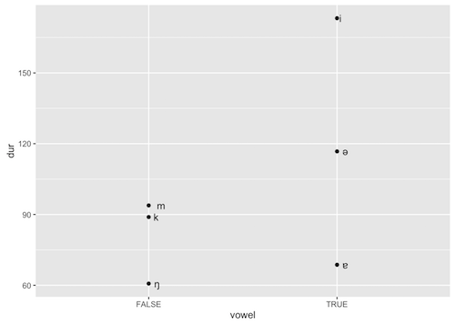

### phonpack
#### [ˈfʌnpak]
A package of fun(ctions) for doing phonetics in R

Longer introduction here: https://resunay.com/misc/phonpack-intro.html

##### Example: Plot vowel vs. consonant durations in `m_a_monkey.TextGrid`

```R
library(phonpack)
library(ggplot2)

readTextGrid("TGs/m_a_monkey.TextGrid") %>% # Read data
  getTierByNumber(1)                    %>%
  getTierIntervals()                    %>%
  
  mutate(                                   # Wrangle data
    dur = (xmax - xmin) * 1000,
    vowel = grepl("ə|ɐ|i", text)
  )                                     %>%
  
  ggplot(aes(x = vowel, y = dur)) +         # Plot data
  geom_point() +
  geom_text(aes(label = text), hjust = -1)
```



Version 0.0.0.9000
- A set of helper functions to a) quickly retrieve and b) interact with Praat TextGrid data.
- Use write functions with caution! Don't run on live data.
- ~~Read only for now – no functions to modfiy (e.g. create new tiers) TextGrids (yet).~~
